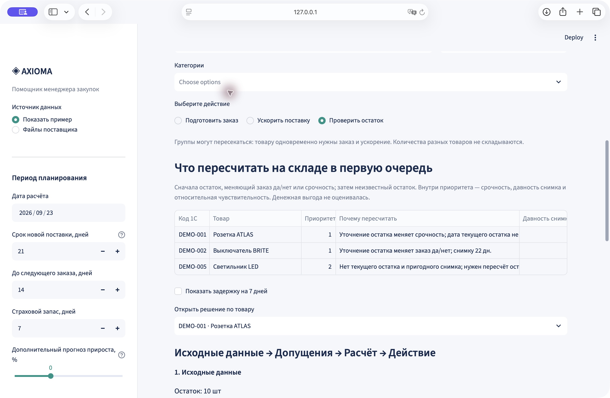
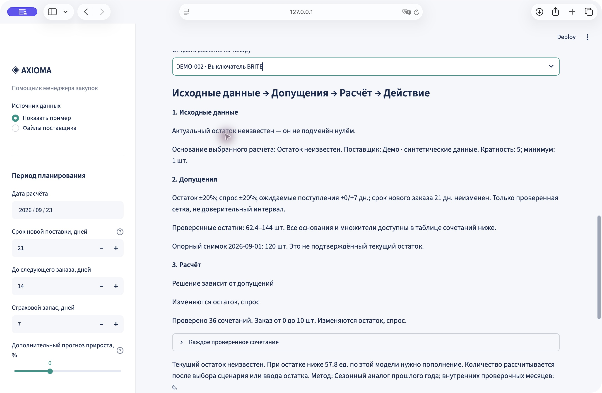

# Axioma — что заказать, что ускорить, что сначала проверить

**Рабочее место менеджера закупок Электрокомплект.** Сегодня пополнение считают в Excel; редкие крупные продажи и неполные остатки затрудняют решение. Axioma загружает отчёты, отделяет разовые всплески, рассчитывает проект заказа и показывает, насколько решение зависит от явно заданных допущений. Менеджер проверяет основание каждой строки и выгружает утверждённый заказ по поставщикам.

**Главная идея: неполные данные → объяснимое действие.** На одном экране `app.py` три группы: **«Подготовить заказ»**, **«Ускорить поставку»**, **«Проверить остаток»**. Диапазон сценариев не является доверительным интервалом; вне проверенных условий устойчивость не заявляется.

## Проверено, а не обещано

| Проверка | Подтверждённый результат |
|---|---|
| Корректность и пользовательский сценарий | **124 теста пройдены**, включая загрузку XLSX → пересчёт остатка → утверждённый Excel |
| Автоматический проход до Excel, медиана 3 запусков | **11,47 с** для 724 товаров Systeme Electric; **59,20 с** для 3 184 товаров IEK |
| Реальные входные данные | **12 файлов, 2 поставщика, 3 908 товаров** |
| Сравнение политик запасов | **По 100 SKU двух поставщиков**, три политики, два режима дефицита; проигрыши опубликованы |
| Устойчивость решения | **70 782 проверенных сочетания** остатка, спроса и даты поступления |
| Задержка +7 дней на реальном каталоге Systeme Electric | **1 дополнительная срочная позиция** среди 497 товаров с выбранным известным остатком |

Это проверки поведения и данных, не процент точности и не измерение экономии. [Протокол с командами](docs/decision-verification.md) · [исходные агрегаты](docs/decision-checks.json) · [замеры времени и влияния на решения](docs/measured-effect.md). Время измерено на одном ноутбуке без проверки менеджером; это не доказанная экономия рабочего времени.



*Скриншот работающего `app.py`, синтетическое демо. Количества и названия компаний из коммерческих файлов на изображении не используются.*

## Где здесь машинное обучение

**Прогноз спроса — обучаемая модель `HistGradientBoostingRegressor`**, общая для товаров: лаги спроса, средние уровни, доля нулевых месяцев и календарные признаки. Обучение использует историю до даты прогноза; результат смешивается с локальным средним для ограничения нестабильности. При менее 200 обучающих примерах работает статистический автовыбор. Поэтому маленькое синтетическое демо показывает запасной статистический режим; обучаемая модель проверялась на полных каталогах. [Код модели](src/pooled.py) · [методика](docs/methodology.md).

**Сценарии, очередь пересчёта и MOQ — прозрачные правила поверх прогноза.** Они объясняют последствия неполных данных. LLM не назначает количества заказа. Использование Codex при разработке указано отдельно от ML-функции продукта.

В сохранённой ретроспективе средняя по SKU WAPE общей модели / простого среднего: **IEK 133,07% / 140,61%; Systeme Electric 104,39% / 105,24%**. Меньше — лучше, WAPE не является процентом точности. Улучшение ограниченное; статистическая значимость и независимый финальный результат не заявляются. [Полная таблица, другие методы и ограничения](docs/validation.md).

## Какой эффект удалось измерить

- На реальных данных **397 товаров** имеют переключение «заказывать / не заказывать» при изменении только предполагаемого остатка внутри заданной сетки: 47 Systeme Electric и 350 IEK. Это основание для адресного пересчёта, а не доказательство ошибочного физического остатка.
- Среди 497 рассчитываемых позиций Systeme Electric включение фильтра разовых продаж изменило **10 заказов: 5 уменьшились, 5 увеличились**. Модель переобучается на обработанной истории, поэтому направление не обязано быть только вниз. Изменение количества само по себе не доказывает улучшение.
- **Денежный эффект и сокращение ручного времени пока не измерены.** Для них подготовлен [протокол контрольного пилота и карта доказательств](docs/pilot.md).

## Что показала проверка решений по запасам

В `app.py` появилась **«Проверка эффекта»**: одинаковые условия → три политики → дневной баланс → проигранные случаи → ZIP протокола. Можно ввести собственные ставки затрат, увидеть чувствительность и скачать пустые задания для контрольного пилота. Цены компании не выдумываются.

**Новый результат не подтверждает превосходство ML.** В ретроспективной симуляции на первых 100 подходящих SKU каждого поставщика, при потерянной продаже:

| Поставщик | Простое среднее: обслужено сразу | Общая ML: обслужено сразу | SKU с положительным спросом / проверено |
|---|---:|---:|---:|
| Systeme Electric | 78,66% | 66,49% | 44 / 100 |
| IEK | 70,19% | 58,65% | 73 / 100 |

Это средние доли по SKU, **не фактически предотвращённые потери**. Условия: июнь–август 2026, начальный запас 21 день прошлого спроса, срок/пересмотр/страховка 21/14/7; месячные продажи равномерно распределены по дням. Общая модель обучается на выбранной сотне товаров. Этот период уже просматривался; независимого финального теста нет. Простой метод доступен в настройках; алгоритмы не подгонялись под результат. [Оба режима дефицита, автовыбор, запас, смещение, все проигрыши и команды](docs/inventory-simulation.md).

## Запуск за минуту

Python 3.11–3.14; текущая проверка — macOS / Python 3.14. В папке проекта:

```bash
python3 -m venv .venv
source .venv/bin/activate
python -m pip install -r requirements.txt
python -m streamlit run app.py
```

Windows: `py -m venv .venv`, затем `.venv\Scripts\python.exe -m pip install -r requirements.txt` и `.venv\Scripts\python.exe -m streamlit run app.py`.
Открыть http://localhost:8501. Интернет нужен для установки; демо не требует ключей, подписок и файлов компании. После обновления кода перезапустите Streamlit. `localhost` доступен только на компьютере запуска.

## Что проверить за первые 30 секунд

Оставьте **«Показать пример»**, дату **23.09.2026** и настройки по умолчанию. Все шесть товаров демо — синтетические.

- **«Проверить остаток» → DEMO-002:** текущий остаток неизвестен, снимку 22 дня; заказ в проверенной сетке **0–10 шт.** Решение зависит от допущений, безусловный заказ не утверждается.
- **«Показать задержку на 7 дней»:** DEMO-001 становится срочным. Обычный заказ остаётся **40 шт.**, но до его прихода появляется дефицит около **11,08 шт.** Заказ не скрывает этот разрыв.
- **DEMO-005:** нет ни текущего остатка, ни пригодного снимка — **недостаточно данных даже для сценариев**.

Для каждого товара доступны исходные данные, допущения, расчёт и действие. Откройте таблицу всех сочетаний, чтобы проверить диапазон. Устойчивое «не заказывать» выделено отдельно от нехватки данных.

## Законченный пример: от неопределённости до Excel

1. Откройте DEMO-002 в очереди **«Проверить остаток»**. Посмотрите возраст снимка, причину приоритета и диапазон 0–10.
2. В **«Внести подтверждённый остаток после пересчёта»** введите **20** и нажмите **«Применить уточнённый остаток»**. Это учебный физический пересчёт, не фактический склад компании.
3. Перейдите в **«Подготовить заказ»**, выберите DEMO-002. Проверьте новое количество **40 шт.**, кратность **5**, MOQ **1** и основание **«Ручной пересчёт на 2026-09-23»**. Если риск дефицита возник до новой поставки, отдельно требуется ускорение.
4. В **«Проверить и утвердить заказ»** отметьте строку, проверьте количество и укажите имя проверившего. Скачайте утверждённый Excel либо добавьте строку в корзину поставщиков.
5. В Excel сохранены выбранный остаток, допущения и диапазон сценариев, происхождение данных, версия файлов и расчёта, параметры и проверивший. Изменение исходных данных сбрасывает отметки; уже сохранённая корзина хранит свою версию.

С реальными файлами начало то же: **«Файлы поставщика» → поставщик → ZIP или шесть XLSX → очередь действий**. Для неизвестного остатка можно ввести подтверждённое значение или явно выбрать сценарий по снимку с отдельным подтверждением допущения. [Схема файлов и подробная математика](docs/calculation-and-import.md).

<details>
<summary>Скриншот: исходные данные → допущения → расчёт</summary>



Синтетический DEMO-002: опорный снимок 120 шт., 36 сочетаний, решение зависит от допущений.

</details>

## Сценарий защиты на 3 минуты

**0:00–0:25.** «Наш пользователь — закупщик. Мы превращаем неполные данные в решение: что заказать, что ускорить и что сначала проверить». Покажите три группы.

**0:25–1:15.** DEMO-002: исходный снимок → диапазон 0–10 → причина пересчёта → подтверждённый остаток 20 → новое решение. Объясните, что сетка остаток ±20%, спрос ±20%, задержка 0/7 дней задана явно и изменяется менеджером.

**1:15–1:50.** Эксперимент +7 дней, DEMO-001: размер заказа тот же, срочность другая. «Обычная поставка не исправляет дефицит, который случится раньше неё».

**1:50–2:25.** Отметьте DEMO-002, введите имя, выгрузите Excel. Покажите MOQ, кратность, поставщика и происхождение решения.

**2:25–3:00.** Откройте «Проверка эффекта»: три политики, два режима дефицита, проигранные случаи и протокол. «Мы проверяем решения и показываем, когда простой метод лучше. Денежная экономия пока не доказана; подготовлены задания пилота с закупщиком». Синтетическая арифметика отдельно проверяется во вкладке «Проверка кейса».

## Доказательства и воспроизведение

```bash
python -m pytest -q
python scripts/check_decisions.py
python scripts/compare_inventory.py --output /tmp/axioma-demo-effect.json
python scripts/check_decisions.py --folder "/путь/к/IEK" --supplier IEK
python scripts/check_decisions.py --folder "/путь/к/Systeme electric" --supplier "Systeme Electric"
```

Тесты проверяют устойчивое пополнение, изменение решения после пересчёта, промежуточный дефицит при задержке, подавление разовой продажи и сохранение повторяющегося крупного спроса. Проверены ручное утверждение, ограничения количества и происхождение данных в реальном XLSX. [Протокол сценариев предыдущей версии](docs/decision-verification.md) · [проверка нового сравнения запасов](docs/effect-verification.md), [правила сценариев и очереди](docs/robustness.md).

Историческая оценка прогноза **не смешивается** с синтетическими примерами: [результаты двух поставщиков](docs/validation.md). Новая доработка не подбирает модель по проверочным месяцам и не меняет её настройку. Ранее ограниченные выборки просматривались при разработке, поэтому сохранённая ретроспектива не объявляется полностью независимой; для внешнего подтверждения нужен новый период. Экономия, гарантированная точность и превосходство не заявляются.

## Границы и устройство

- Месячный снимок не восстанавливает неизвестные поступления и резервы. Сценарии — условные варианты; отсутствие записей продаж не считается доказанным нулём.
- Сроки 21/14/7 дней и отклонения ±20% — стартовые допущения, а не согласованные параметры поставщиков. ID клиента и точные периоды отсутствия в материалах неполны; соответствующие проверки частично синтетические.
- Приоритет пересчёта основан на смене решения, срочности, давности снимка и относительной чувствительности. Без цен денежная выгода не сравнивается; метры, штуки и бухты не складываются.
- Исправления и корзина живут в текущей сессии и скачанном файле. Нет авторизации, базы аудита, прямой интеграции с 1С и автоматической отправки заказов.
- Основной сценарий — `app.py`, расчёт спроса — `src/engine.py`, единая дневная политика — `src/planning.py`, конечная сетка и очередь — `src/robustness.py`. Импорт — `src/data.py`, утверждение — `src/orders.py`; сравнение политик и сценарных затрат — `src/effect.py`.

Работа команды в `app_extended.py` и `axioma/` сохранена: [дополнительная реализация](docs/EXTENDED.md). Новый сценарий встроен в основное приложение. [Карта требований и план пилота](docs/JURY.md), [методы прогноза](docs/methodology.md), [предыдущая проверка](docs/final-verification.md).

Выгрузки компании и секреты не включены в Git. Демо синтетическое; внешние AI API не вызываются. OpenAI Codex использован при разработке. Лицензии сторонних библиотек сохраняются в пакетах. GitHub Actions ранее заблокирован биллингом организации; успешная внешняя CI-проверка этой версии не заявляется.
